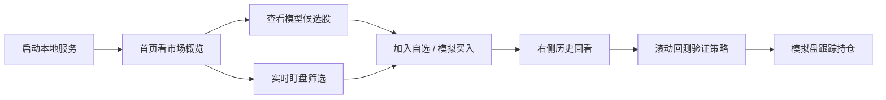

# A-Share Local Lab


A股 AI 选股与本地模拟盘 -- 面向 A 股研究场景的本地工作台。

集成了 AI 选股、滚动回测、实时盯盘、固定历史回看、自选股管理、AI 分析、热点快报和纸交易模拟盘，一个界面完成从选股到模拟交易的完整闭环。

## 功能一览

| 页面 | 说明 |
|------|------|
| 首页 | 市场概览、上证指数分时、美股纳指、领涨板块、模型摘要、刷新状态 |
| 模型候选股 | 未来 5 日收益预测、推荐原因拆解、预测依据、风险提示、置信度 |
| 滚动回测 | 滑动窗口训练+预测、资产曲线图、分窗口指标（Sharpe/IC/RankIC/胜率/回撤） |
| 实时盯盘 | 实时快照、涨跌颜色区分、直接查看历史或模拟买入 |
| 自选股票 | 本地持久化、搜索添加、一键查看历史、一键模拟买入 |
| 模拟盘 | 本地下单、持仓跟踪、手续费参数、导入导出、收益快照 |
| 热点快报 | 多源新闻聚合、AI 摘要与利好利空标注、分类筛选、无限滚动 |
| 条件选股 | 按预测收益和置信度筛选候选池 |
| A股行业轮动 | 行业涨跌排名、领涨股 |
| 盘前盘后 | 盘前盘后资讯汇总 |
| AI 分析 | 单股多维度分析：趋势、波动率、近期涨幅、模型信号、相关热点 |
| 预警通知 | 板块领涨预警 |
| 历史回看 | 右侧固定面板，支持日/周/月/季/年、1分/5分/15分/30分/60分、悬停提示、缩放、大图模式 |

## 快速开始

```powershell
# 1. 克隆项目
git clone https://github.com/Lominih/Agu.git
cd Agu

# 2. 创建虚拟环境并安装依赖
python -m venv .venv
.venv\Scripts\pip install -r requirements.txt

# 3. 启动服务
.\start.ps1
# 或手动:
.venv\Scripts\python.exe -m uvicorn app.main:app --host 127.0.0.1 --port 8000

# 4. 浏览器打开
# http://127.0.0.1:8000
```

## 使用流程



## 滚动回测

真正的滑动窗口回测，模拟真实策略表现：

- 训练窗口（默认 120 天）训练 LightGBM 模型
- 预测窗口（默认 20 天）做样外预测
- 窗口向前滑动，重复训练+预测
- 使用不重叠的 5 日周期构建资产曲线

输出指标：
- 累计收益 / 年化收益 / 最大回撤
- Sharpe / IC / RankIC
- 分窗口详情（每个窗口的胜率、收益、Sharpe）

可通过前端"滚动回测"页面调整参数并查看结果，也可直接调用 API：

```powershell
curl "http://127.0.0.1:8000/api/backtest?train_window=120&test_window=20&top_n=10"
```

## 模型说明

使用 LightGBM 回归模型，基于 12 个基础因子预测未来 5 日收益：

| 因子 | 含义 |
|------|------|
| ret_5 / ret_10 / ret_20 | 近 5/10/20 日收益 |
| volatility_10 / volatility_20 | 10/20 日波动率 |
| price_vs_ma10 / price_vs_ma20 | 相对 10/20 日均线偏离 |
| ma_gap_10_20 | 10/20 日均线间距 |
| volume_ratio_5 / volume_ratio_20 | 5/20 日量比 |
| drawdown_20 | 20 日最大回撤 |
| momentum_spread_5_20 | 短中期动量差 |

推荐结果包含：推荐原因标签、因子贡献拆解、置信度评分、风险等级。

## AI 分析

对单只股票做多维度分析（`/api/stock-analysis/{symbol}`）：

- 近期涨幅（5/10/20 日）
- 趋势判断（均线多头/空头/横盘）
- 波动率
- 模型预测信号（排名、预测收益、原因）
- 相关热点新闻
- 利好因素 / 利空因素

## 模拟盘

本地纸交易，不连接券商，不涉及真钱。

- 支持买入 / 卖出，实时行情定价
- 手续费、印花税、滑点可配置
- 持仓跟踪：成本、市值、浮动盈亏
- 交易记录：时间、价格、费用
- 导入 / 导出模拟盘状态

## 数据回退策略

| 场景 | 优先 | 回退 |
|------|------|------|
| 实时行情 | 实时快照 | 最近收盘价 |
| 历史日线 | 本地真实数据 | 远程抓取 |
| 热点快报 | 并行多源抓取 | 最近成功缓存 |
| 市场概览 | 最新抓取 | 最近缓存 |

## 技术栈

- 后端：FastAPI
- 建模：LightGBM、scikit-learn
- 数据处理：pandas、numpy
- 行情与资讯：AKShare、easyquotation
- 前端：原生 HTML + CSS + JavaScript（无框架）
- 运行方式：本地单机、浏览器访问

## 项目结构

```text
Agu/
├── app/                    # FastAPI 入口与服务层
│   ├── main.py             # API 路由
│   ├── core/config.py      # 路径配置
│   └── services/           # 数据、建模、行情、新闻、模拟盘
├── frontend/               # 前端静态资源
│   ├── index.html          # 页面结构
│   ├── app.js              # 交互逻辑
│   └── styles.css          # 样式
├── scripts/                # 训练与刷新脚本
├── data/                   # 本地数据文件
├── models/                 # 训练产物
├── tests/                  # 测试
├── requirements.txt
└── start.ps1               # Windows 启动脚本
```

## API 端点

| 方法 | 路径 | 说明 |
|------|------|------|
| GET | /api/health | 健康检查 |
| GET | /api/overview | 首页概览（模型摘要+市场） |
| GET | /api/picks | 模型候选股 |
| GET | /api/backtest | 滚动回测结果 |
| GET | /api/market-overview | 市场概览（上证/纳指/板块） |
| GET | /api/hot-news | 热点快报 |
| GET | /api/watchlist | 盯盘快照 |
| GET | /api/history/{symbol} | 历史行情 |
| GET | /api/chart-history/{symbol} | 图表历史 |
| GET | /api/watch-intraday/{symbol} | 分时数据 |
| GET | /api/search | 股票搜索 |
| GET | /api/favorites | 自选股列表 |
| POST | /api/favorites | 添加/删除自选 |
| GET | /api/portfolio | 模拟盘快照 |
| POST | /api/portfolio/orders | 模拟下单 |
| POST | /api/portfolio/reset | 重置模拟盘 |
| POST | /api/portfolio/settings | 更新模拟盘参数 |
| GET | /api/portfolio/export | 导出模拟盘 |
| POST | /api/portfolio/import | 导入模拟盘 |
| GET | /api/screener | 条件选股 |
| GET | /api/rotation | A股行业轮动 |
| GET | /api/prepost | 盘前盘后 |
| GET | /api/stock-analysis/{symbol} | AI 单股分析 |
| GET | /api/stock-info/{symbol} | 股票基本信息 |
| GET | /api/alerts | 预警通知 |
| GET | /api/model-history | 模型版本历史 |
| GET | /api/data-health | 数据健康报告 |
| POST | /api/train | 重新训练模型 |
| POST | /api/refresh-real-data | 刷新真实数据 |
| GET | /api/refresh-real-data/status | 刷新任务状态 |

## 测试

```powershell
.venv\Scripts\python.exe -m pytest -q
```

## 常用命令

```powershell
# 启动服务
.\start.ps1

# 手动训练模型
.venv\Scripts\python.exe scripts\train.py

# 刷新真实数据并重训
.venv\Scripts\python.exe scripts\refresh_real_data.py --pool hs300

# 运行测试
.venv\Scripts\python.exe -m pytest -q
```

## 免责声明

本项目仅用于本地研究、学习和纸交易模拟，不构成任何投资建议，也不保证数据实时性、完整性或收益结果。