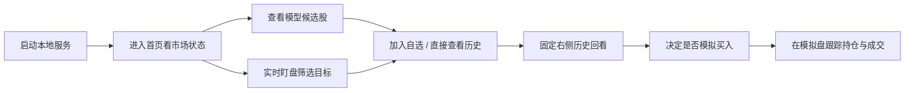

# A-Share Local Lab


## 导航

- [简介](#a-share-local-lab)
- [界面预览](#界面预览)
- [功能一览](#功能一览)
- [快速开始](#快速开始)
- [FAQ](#faq)
- [Roadmap](#roadmap)

一个面向 A 股研究场景的本地工作台，集成了 AI 选股、实时盯盘、固定历史回看、自选股管理、热点快报和纸交易模拟盘。

它不是“只给一个模型分数”的小工具，而是一个更接近看盘软件工作流的本地研究平台：

- 左侧导航切换候选股、盯盘、自选、模拟盘和资讯页
- 右侧固定历史回看，默认显示上证指数，点击任意股票即可切到单股
- 实时行情、历史行情、模型候选、模拟交易都放在一个界面里联动使用

项目默认面向本地单机运行，不依赖云服务器，适合想在自己电脑上搭一个 A 股研究工作台的人继续扩展。

## 界面预览

> 建议后续补充两张真实截图到 `docs/screenshots/`：
>
> - `home-dashboard.png`：首页 + 右侧固定历史回看
> - `watchlist-history.png`：自选股点击查看后的历史回看状态

示意展示位：

```text
docs/
└─ screenshots/
   ├─ home-dashboard.png
   └─ watchlist-history.png
```

## 使用流程



## 这个项目解决什么问题

很多本地量化原型都会停在下面几步：

- 拉一份行情
- 跑一个模型
- 输出一张候选股表

但真实使用时，通常还需要：

- 一边看候选股，一边盯实时盘面
- 选中的股票能马上切到历史图
- 找到股票后能加入自选或直接做纸交易
- 数据源失败时，页面不要整块失效

这个项目就是把这些“真正会用到的交互链路”补完整。

## 核心特点

- 本地优先：默认在本机运行，适合个人研究和持续迭代
- 工作台体验：左侧导航 + 右侧固定历史回看，更接近看盘软件
- 数据回退稳：实时失败回退收盘，历史失败回退缓存或快照
- 模型可解释：候选股不只显示分数，也展示推荐原因、依据和风险提示
- 模拟盘闭环：支持从搜索、自选、候选股直接进入本地纸交易
- 可继续扩展：条件选股、行业轮动、盘前盘后、事件时间线、预警通知都已预留页面

## 功能一览

### 1. 首页

- 模型摘要
- 刷新状态
- 市场概览
- 上证指数当日分时
- 美股上一交易日行业表现

### 2. 模型候选股

- 未来 5 日收益预测
- 推荐摘要
- 推荐原因拆解
- 预测依据
- 风险提示
- 置信度展示

### 3. 实时盯盘

- 实时快照优先
- 失败时回退到最近收盘
- 涨跌颜色区分
- 可直接查看历史或模拟买入

### 4. 自选股票

- 本地持久化保存
- 搜索后快速添加
- 一键查看右侧历史回看
- 一键模拟买入

### 5. 固定历史回看

- 默认显示上证指数
- 支持点击任意股票切换
- 支持日 / 周 / 月 / 季 / 年
- 支持 1分 / 5分 / 15分 / 30分 / 60分 / 5日
- 支持悬停提示、缩放、大图模式、单日下钻

### 6. 模拟盘 / 纸交易

- 本地账户与持仓
- 买入、卖出、成交记录
- 手续费 / 印花税 / 滑点参数
- 导入 / 导出
- 收益与持仓快照

### 7. 热点与研究辅助页

- 热点快报
- 条件选股
- 行业轮动
- 盘前盘后
- 事件时间线
- 预警通知

## 适合谁用

- 想本地搭一个 A 股研究面板的个人开发者
- 想把“选股 + 看盘 + 纸交易”串起来的量化爱好者
- 想基于现成前后端骨架继续做策略研究的人

## 不适合谁用

- 期待开箱即用自动实盘交易的人
- 期待机构级低延迟行情或交易通道的人
- 只想要一个纯 Notebook 回测脚本的人

## 技术栈

- 后端：`FastAPI`
- 建模：`LightGBM`、`scikit-learn`
- 数据处理：`pandas`、`numpy`
- 行情与资讯：`AKShare`、`easyquotation`
- 前端：原生 `HTML + CSS + JavaScript`
- 运行方式：本地单机、浏览器访问

## 项目结构

```text
Agu/
├─ app/                    # FastAPI 入口与服务层
├─ frontend/               # 前端静态资源
├─ scripts/                # 训练、刷新等脚本
├─ data/                   # 本地数据、状态、缓存、模拟盘持久化
├─ models/                 # 训练产出的模型文件
├─ tests/                  # 当前已有的基础测试
├─ requirements.txt        # Python 依赖
├─ start.ps1               # Windows 本地启动脚本
└─ README.md
```

## 快速开始

### 环境要求

- Windows PowerShell
- Python 3.11 及以上
- 可访问外网的数据抓取环境

### 一键启动

```powershell
cd D:\Projects\codex\Agu
.\start.ps1
```

启动脚本会自动完成：

1. 创建 `.venv`
2. 安装依赖
3. 清理当前项目旧的 `uvicorn` 进程
4. 在 `8000 / 8001 / 8002 / 8010` 中寻找空闲端口
5. 启动 `uvicorn app.main:app`

启动后访问：

- [http://127.0.0.1:8000](http://127.0.0.1:8000)

如果 `8000` 被占用，脚本会自动切换到其它端口，并在终端输出最终地址。

### 手动运行

```powershell
python -m venv .venv
.venv\Scripts\Activate.ps1
python -m pip install --upgrade pip
pip install -r requirements.txt
python -m uvicorn app.main:app --host 127.0.0.1 --port 8000 --reload
```

## 数据与回退策略

这个项目的一个重点是“不要因为某个外部源抽风，整个页面就失效”。

当前回退逻辑大致如下：

- 实时盯盘：优先实时快照，失败时回退到最近收盘
- 历史回看：优先本地历史 / 远程历史，失败时回退到缓存或最新快照
- 热点快报：优先最新抓取，失败时回退到最近成功缓存
- 市场概览：优先最新抓取，失败时回退到最近缓存

这意味着即使外部接口暂时不稳定，页面大多数区域仍然可以继续工作。

## 模拟盘说明

模拟盘是本地纸交易，不连接券商，也不会动真钱。

支持能力：

- 本地下单
- 本地持仓
- 本地成交记录
- 手续费参数调整
- 导入 / 导出模拟盘状态

适合做：

- 看盘时记录交易想法
- 验证候选股是否值得跟踪
- 在本地形成“研究 -> 观察 -> 模拟”的闭环

## 数据来源说明

本项目会结合本地文件、历史缓存和第三方行情接口做回退展示，常见来源包括：

- `AKShare`
- `easyquotation`
- 本地缓存与训练产物

界面里展示的数据只用于本地研究和纸交易，不保证与任何第三方平台完全同口径。

## 开源参考

本项目当前以本地研究工作台为目标，界面和流程设计参考了常见的看盘软件使用习惯，也结合了你之前提到的开源项目思路做了本地化整合。

## 当前已有测试

当前仓库已经包含基础测试，并可直接运行：

```powershell
.venv\Scripts\python.exe -m pytest -q
```

你也可以做最小运行检查：

```powershell
.venv\Scripts\python.exe -m compileall app scripts
.venv\Scripts\python.exe scripts\train.py
.venv\Scripts\python.exe -m uvicorn app.main:app --host 127.0.0.1 --port 8000
```

## FAQ

### 1. 这是自动实盘交易系统吗？

不是。当前定位是本地研究、盯盘和纸交易平台，不接券商，不会自动下真实订单。

### 2. 为什么有时候历史图只能看到很少几根数据？

如果某只股票本地没有完整历史，同时远程历史源暂时失败，系统会回退到缓存或最新快照，优先保证“能看”，再保证“完整”。

### 3. 为什么实时数据、历史数据、同花顺看到的口径可能不完全一致？

因为不同页面可能来自不同数据源或不同回退层级，比如实时快照、收盘价、本地历史缓存、远程历史接口，它们的时间点和复权口径可能不同。

### 4. 这个项目适合部署到服务器吗？

可以继续改造成服务化版本，但当前默认是为本地单机使用设计的，启动脚本和运行方式也更偏 Windows 本地工作流。

### 5. 我可以在这个基础上继续加自己的模型吗？

可以。这个项目更像一个已经有前后端交互、数据回退和本地模拟盘的骨架，适合继续替换或扩展模型、因子和数据源。

## 常用命令

### 启动服务

```powershell
.\start.ps1
```

### 手动训练模型

```powershell
.venv\Scripts\python.exe scripts\train.py
```

### 刷新真实数据并重训

```powershell
.venv\Scripts\python.exe scripts\refresh_real_data.py --pool hs300
```

### 运行测试

```powershell
.venv\Scripts\python.exe -m pytest -q
```

## 常用接口

- `GET /api/health`
- `GET /api/overview`
- `GET /api/model-history`
- `GET /api/data-health`
- `GET /api/market-overview`
- `GET /api/hot-news`
- `GET /api/picks`
- `GET /api/watchlist`
- `GET /api/history/{symbol}`
- `GET /api/watch-intraday/{symbol}`
- `GET /api/search`
- `GET /api/favorites`
- `GET /api/portfolio`
- `GET /api/portfolio/export`
- `POST /api/portfolio/import`
- `POST /api/portfolio/orders`
- `POST /api/portfolio/reset`
- `POST /api/train`
- `POST /api/refresh-real-data`
- `GET /api/refresh-real-data/status`

## 当前限制

- 目前不是自动交易系统
- 目前不提供券商接入
- 目前不是机构级低延迟行情系统
- 外部数据源之间仍可能存在口径差异
- 某些股票在无本地完整历史、且远程源异常时，可能只能回退到快照级历史
- 当前更偏 Windows 本地工作流

## 后续优化方向

- 接入正式的 `.env` 配置解析
- 补更完整的 API 和服务层测试
- 拆分抓取、训练、刷新任务
- 继续增强图表交互与大图模式
- 加入更完整的回测、评估和模型版本管理
- 增加提醒、通知和更细的模拟盘统计

## Roadmap

- [ ] 补真实项目截图并完善 GitHub 首页展示
- [ ] 接入更稳定的分钟级历史数据源
- [ ] 统一更多数据源口径与复权策略
- [ ] 增加更完整的回测指标与模型版本追踪
- [ ] 提升模拟盘的成交、持仓和收益统计能力
- [ ] 增加提醒、通知和条件监控能力

## 截图说明

如果你要补 GitHub 首页截图，建议放到：

- `docs/screenshots/home-dashboard.png`
- `docs/screenshots/watchlist-history.png`

也可以继续扩展为：

- `docs/screenshots/paper-trading.png`
- `docs/screenshots/hot-news.png`

## 免责声明

本项目仅用于本地研究、学习和纸交易模拟，不构成任何投资建议，也不保证数据实时性、完整性或收益结果。
